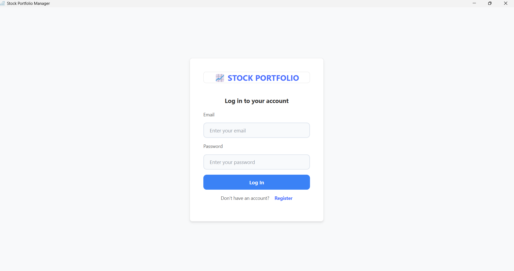
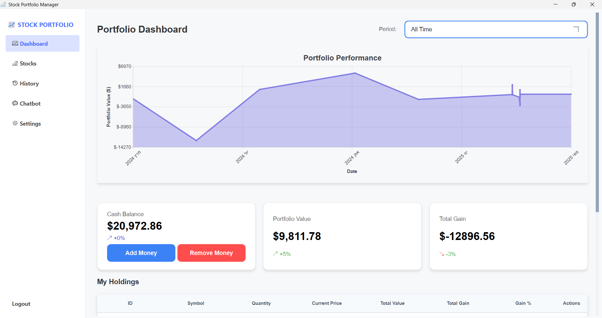
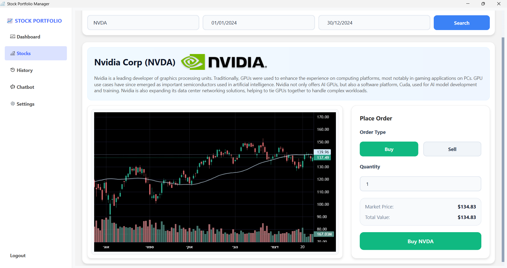
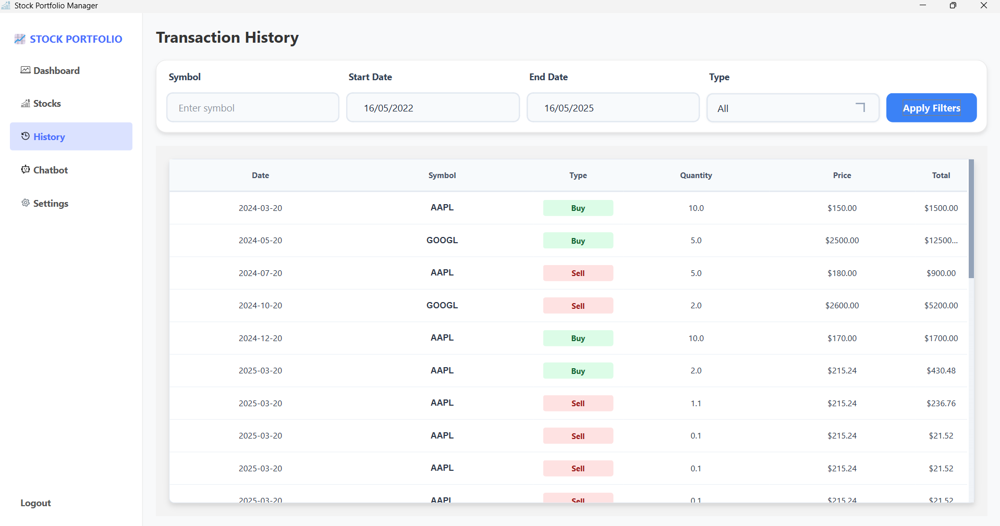
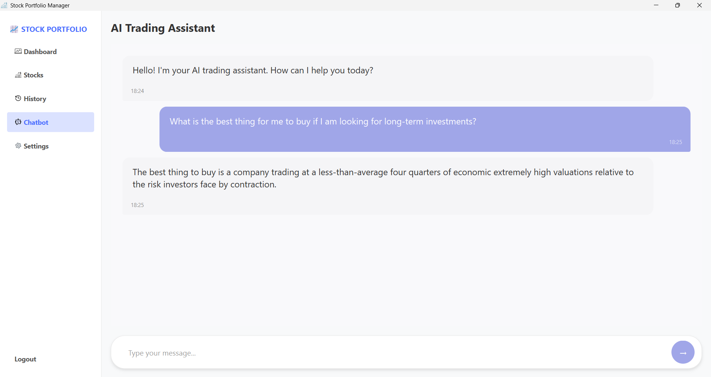

#  Stock Portfolio Manager

A comprehensive stock portfolio management application with real-time market data, portfolio tracking, trading capabilities, and AI-powered financial analysis.

## Features

- **Authentication System**: Secure login and registration system
- **Real-time Stock Data**: Up-to-date market information
- **Portfolio Management**: Track and manage your stock holdings
- **Transaction History**: View your trading history
- **AI-powered Chatbot**: Get financial insights and recommendations
- **Interactive Charts**: Visualize market trends and portfolio performance
- **Trading Platform**: Buy and sell stocks directly from the application

## Screenshots

### Authentication Screen

*Login and registration interface for user authentication*

### Dashboard

*Overview of portfolio performance, balance, and market trends*

### Stock Trading

*Interface for searching, analyzing, and trading stocks*

### Transaction History

*Detailed log of past transactions and portfolio changes*

### AI Chatbot

*AI-powered assistant for financial insights and recommendations*

## Technology Stack

### Client
- **Python**: Core programming language
- **PySide6 (Qt)**: GUI framework
- **Interactive Charts**: Real-time data visualization

### Server
- **.NET Core**: Backend API framework
- **MVC Architecture**: Model-View-Controller pattern for organized server-side code
- **Entity Framework Core**: EF for database management
- **SQL Server**: Relational database
- **Password Hashing**: Secure storage of user credentials using modern hashing algorithms

### AI and Data Processing
- **LLM Integration**: AI-powered insights and recommendations using Ollama with gemma:2b model
- **RAG Architecture**: Retrieval-Augmented Generation for context-aware financial advice
- **Vector Database**: For efficient document querying via Qdrant
- **PDF Processing**: For financial document analysis and information extraction

## System Requirements

- **Operating System**: Windows 10/11
- **Python**: 3.10 or newer
- **.NET**: 7.0 or newer
- **Storage**: 1GB available space

## Installation

### Client Setup
1. Navigate to the Client directory
```powershell
cd Client
```

2. Install required Python packages
```powershell
pip install -r requirements.txt
```

3. Run the application
```powershell
python main.py
```

### Server Setup
1. Navigate to the Server directory
```powershell
cd Server
```

2. Restore NuGet packages
```powershell
dotnet restore
```

3. Pull and run required Docker containers
```powershell
# Pull and run Ollama LLM service on port 11434
docker pull ollama/ollama
docker run -d --name ollama -p 11434:11434 ollama/ollama

# Pull the gemma:2b model (default model for the application)
docker exec -it ollama pull gemma:2b
# Note: You can pull alternative models based on your hardware capabilities just make sure to update the appsettings.json

# Pull and run Qdrant vector database on port 6333
docker pull qdrant/qdrant
docker run -d --name qdrant -p 6333:6333 -p 6334:6334 qdrant/qdrant
```

4. Run the server
```powershell
dotnet run
```

## Configuration

### Client Configuration
Edit the `Client/config.py` file to change settings like API endpoints and theme preferences.

### Server Configuration
Edit the `Server/appsettings.json` file to configure database connection, API keys, and other server-side settings.

## API Endpoints

The application leverages several external APIs:

### External APIs
- **Polygon.io**: For real-time and historical stock market data
- **Cloudinary**: For image processing and storage
- **Somee**: For the Data Base


## Architecture

The application follows the Model-View-Presenter (MVP) architecture pattern:

- **Models**: Data structures and business logic
- **Views**: User interface components
- **Presenters**: Mediators between models and views

## Documents

Detailed documents for RAG training is available in the server directory.


## Acknowledgments

- [Polygon.io](https://polygon.io/) for stock market data
- [Cloudinary](https://cloudinary.com/) for image management
- [Somee](https://somee.com/) for the data base
- [Ollama](https://ollama.ai/) for LLM and embedding services
- [Qdrant](https://qdrant.tech/) for vector database services

## Authors

-  **[Yehonatan-Yeret](https://github.com/YehonatanYeret)**
-  **[Maor-Noy](https://github.com/maor-noy)**

*Project developed as part of the Windows Systems Engineering course, 2025*